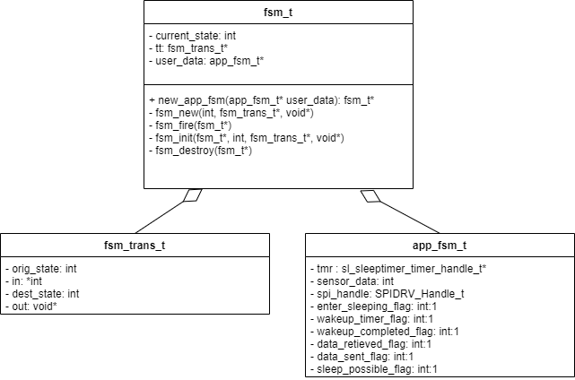
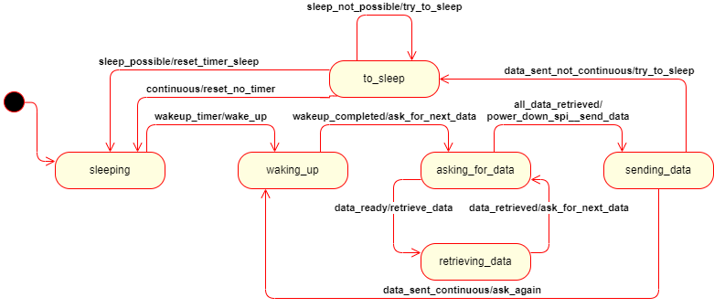
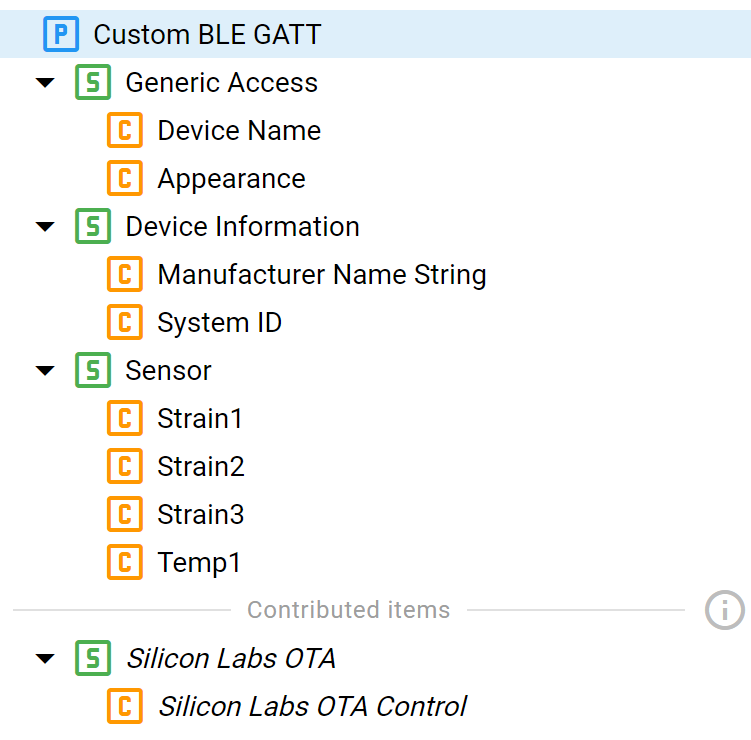
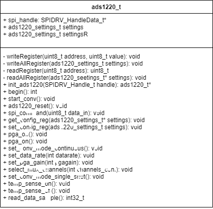

# M20 Screw Project #

## Overview of the project ##

This project aims to allow a BLE microcontroller (EFR32BGM from Silicon Labs) to retrieve strain and temperature data from an ADS1220 through SPI. After this, the information is to be transmitted
through BLE to a receiving device (namely a computer or RaspberryPi).

## Main logic ##

The behavior of the system is ruled by a Mealy FSM.

## BT Profile ##

The BT profile created contains a single characteristic (representing the sensor in charge of measuring 3 strain sensors and 1 temperature sensor) and 4 descriptors, one per 
source of data. Each of the descriptors is enabled with notify and read operations.

## ADS1220 API ##

A class has been created to easily interact with the ADS1220.

